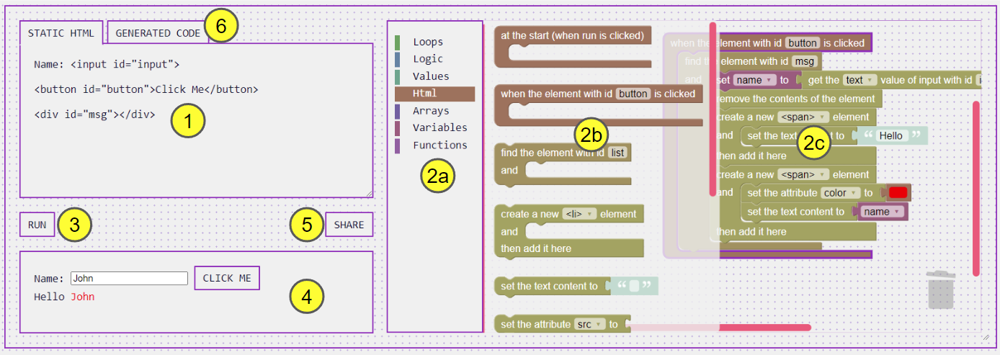

## Understanding the interface

### 1. STATIC HTML Textarea ###
This is where you edit the initial HTML code. The **HTML blocks** mainly operate on the HTML elements specified here.

### 2. Code Blocks Editor ###
You can construct your block program here.

#### (2a) Block categories ####
Select a category to reveal the available blocks in that category.

In some exercises, only a subset of blocks are available.

#### (2b) Available blocks in a category ####
Select a block here.

#### (2c) Block editor ####
Combine the blocks here.

### 3. RUN ###
Click the RUN button to render the HTML code specified in (1) and execute the code blocks specified in (2).

### 4. The Output Area ###
This area emulates a browser window where the HTML code is rendered, and
where the program is running.

### 5. SHARE ###
Click this button to obtain a representation of your code blocks as a URL.

**When you need to submit or share your CYF Blocks Project, this is how you obtain the URL of your project.**

### 6. GENERATE CODE ###
JavaScript code that appears in this tab is generated automatically from the code blocks. You do not have to understand it. You only need to copy it when you need to integrate your code blocks into a webpage.